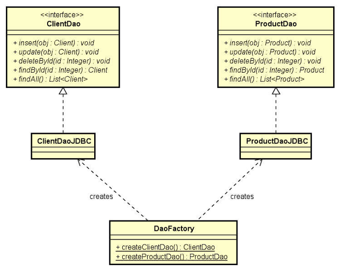
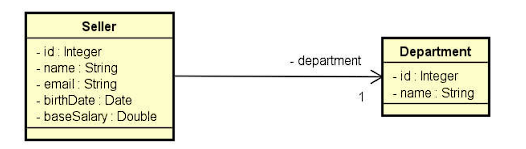

# Objectives:
> Understand the features of JDBC, as well as learn how to build the basic structure of a project and implement the DAO design pattern manually with JDBC.

## UML from DAO, Factory and interface implementation:

## UML from domain models:

## Features implemented:
- [x] insert;
- [x] update;
- [x] delete;
- [x] findById;
- [x] findAll;
- [x] findByDepartment.

## 🛠️ Tools used:
* Java;
* JDBC;
* MySQL;
* Git e GitHub.